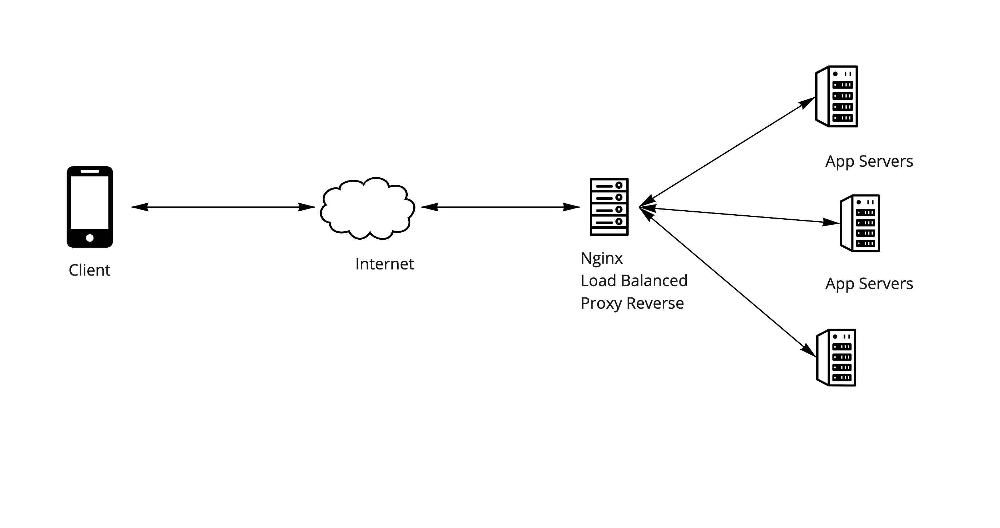

# Docker compose : Nginx Proxy Reverso com múltiplos containers

Um proxy reverso é um servidor que fica entre aplicativos internos e clientes externos, encaminhando solicitações de clientes para o servidor apropriado. Como o NGINX possui vários recursos avançados de balanceamento de carga, segurança e aceleração que faltam na maioria dos aplicativos especializados, o uso do NGINX como proxy reverso nos permite adicionar esses recursos a qualquer aplicativo.

## docker-compose.yml

Com o Compose, definimos um aplicativo de vários contêineres em um único arquivo e, em seguida, giramos nosso aplicativo em um único comando que faz tudo o que precisa ser feito para executá-lo.

## Proxy Reverso

O proxy foi definido com o Docker jwilder/nginx-proxy. Ele gera automaticamente as configurações de proxy reverso para nginx. Para saber mais sobre esse Docker, consulte a documentação completa em https://hub.docker.com/r/jwilder/nginx-proxy.

## Para começar

### Subindo a infra

```bash
docker-compose up
```

## Acessando as aplicações

As aplicações podem ser acessadas pelo browser ou pelo comando Curl. Abaixo as formas de acesso para cada uma das aplicações:

### App1
* http://app1.localhost/
* ```curl --location --request GET 'http://app1.localhost/'```

### App2
* http://app2.localhost/
* ```curl --location --request GET 'http://app2.localhost/'```

### Saídas esperadas

App1
```bash 
{"message":"Hello World Application 01"}
```

App2
```bash 
{"message":"Hello World Application 02"}
```